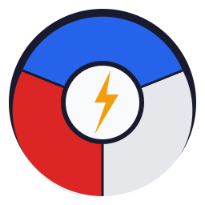
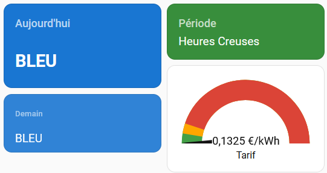

#  EDF Tempo — Custom Component Home Assistant

Module personnalisé pour Home Assistant permettant de suivre en temps réel l'option tarifaire **Tempo d'EDF**.

## Fonctionnalités

| Capteur | Description |
|---|---|
| **Couleur Aujourd'hui** | BLEU / BLANC / ROUGE |
| **Couleur Demain** | Connue à partir de ~10h30 |
| **Période Tarifaire** | Heure Creuse (HC) ou Heure Pleine (HP) |
| **Tarif Actuel** | €/kWh selon couleur + HC/HP |
| **Jours Bleus/Blancs/Rouges restants** | Compteurs sur la saison (finit le 31 août) |
| **Jours Bleus/Blancs/Rouges (saison)** | Compteurs cumulés depuis le 1er septembre |
| **Archive Saison** | Historique complet avec listes de dates par couleur |
| **Binaire : Heure Creuse** | ON entre 22h00 et 06h00 |
| **Binaire : Jour Rouge/Blanc/Bleu** | ON si c'est le cas aujourd'hui |
| **Binaire : Demain Rouge** | Alerte anticipée sur le lendemain |

---

## Installation

### Via HACS (recommandé)
1. Dans HACS → *Intégrations* → *Dépôts personnalisés*
2. Ajouter l'URL du dépôt (`https://github.com/Audiothor/ha_edf_tempo`), catégorie **Intégration**
3. Installer **EDF Tempo**
4. Redémarrer Home Assistant

### Manuellement
1. Copier le dossier `edf_tempo/` dans `/config/custom_components/`
2. Redémarrer Home Assistant

---

## Configuration

1. Aller dans **Paramètres → Appareils & Services → Ajouter une intégration**
2. Chercher **EDF Tempo**
3. Renseigner vos tarifs personnalisés (consultez votre espace client EDF)

### Tarifs par défaut 2024-2025 (TTC)

| Couleur | HC | HP |
|---|---|---|
| 🔵 Bleu | 0.1056 €/kWh | 0.1369 €/kWh |
| ⚪ Blanc | 0.1258 €/kWh | 0.1654 €/kWh |
| 🔴 Rouge | 0.1490 €/kWh | 0.7562 €/kWh |

> Vous pouvez modifier ces tarifs à tout moment via **Configurer** dans la fiche de l'intégration.

---

## Automatisations utiles

### Notification quand demain est rouge
```yaml
automation:
  - alias: "Alerte Tempo Rouge demain"
    trigger:
      - platform: state
        entity_id: binary_sensor.edf_tempo_demain_rouge
        to: "on"
    action:
      - service: notify.mobile_app
        data:
          title: "⚡ Alerte EDF Tempo"
          message: "Demain est un jour ROUGE ! Réduisez votre consommation."
```

### Basculer une prise selon HC/HP
```yaml
automation:
  - alias: "Chauffe-eau en heure creuse"
    trigger:
      - platform: state
        entity_id: binary_sensor.edf_tempo_heure_creuse
        to: "on"
    action:
      - service: switch.turn_on
        entity_id: switch.chauffe_eau
  - alias: "Chauffe-eau hors heure creuse"
    trigger:
      - platform: state
        entity_id: binary_sensor.edf_tempo_heure_creuse
        to: "off"
    action:
      - service: switch.turn_off
        entity_id: switch.chauffe_eau
```

### Condition avancée : jour bleu + heure creuse
```yaml
condition:
  - condition: state
    entity_id: binary_sensor.edf_tempo_jour_bleu
    state: "on"
  - condition: state
    entity_id: binary_sensor.edf_tempo_heure_creuse
    state: "on"
```

---

## Dashboard Lovelace

Voici un exemple pour créer un tableau de bord visuel contenant une grille 2x2 avec des couleurs dynamiques (Bleu, Blanc, Rouge, Vert, Orange) s'adaptant à l'état de chaque capteur :

> 
> *(Capture du dashboard)*

### Prérequis (Card-Mod)
Pour que les fonds des cartes colorent dynamiquement sans changer de thème, ce code utilise [card-mod](https://github.com/thomasloven/lovelace-card-mod).
1. Allez dans **HACS** > **Interface** (Frontend)
2. Cherchez et installez l'extension **card-mod**
3. Rechargez le cache de votre navigateur (`F5`)

### Code Lovelace

Ajoutez une carte **Manuel** dans Home Assistant et collez ce code :

```yaml
type: horizontal-stack
cards:
  # COLONNE GAUCHE (Les jours)
  - type: vertical-stack
    cards:
      - type: entity
        entity: sensor.edf_tempo_couleur_aujourd_hui
        name: Aujourd'hui
        card_mod:
          style: |
            .icon { display: none !important; }
            .info { padding: 24px 16px !important; }
            .value { font-size: 1.8rem !important; font-weight: bold !important; }
            ha-card {
              --secondary-background-color: transparent;
              
                --ha-card-background: #1976d2;
                --primary-text-color: white;
                --secondary-text-color: rgba(255,255,255,0.7);
              
                --ha-card-background: #ffffff;
                --primary-text-color: #212121;
                --secondary-text-color: #757575;
              
                --ha-card-background: #d32f2f;
                --primary-text-color: white;
                --secondary-text-color: rgba(255,255,255,0.7);
              
            }

      - type: entity
        entity: sensor.edf_tempo_couleur_demain
        name: Demain
        card_mod:
          style: |
            .icon { display: none !important; }
            .info { padding: 10px 16px !important; }
            .name { font-size: 0.85rem !important; opacity: 0.8; }
            .value { font-size: 1.2rem !important; }
            ha-card {
              --secondary-background-color: transparent;
              opacity: 0.9;
              
                --ha-card-background: #1976d2;
                --primary-text-color: white;
                --secondary-text-color: rgba(255,255,255,0.7);
              
                --ha-card-background: #ffffff;
                --primary-text-color: #212121;
                --secondary-text-color: #757575;
              
                --ha-card-background: #d32f2f;
                --primary-text-color: white;
                --secondary-text-color: rgba(255,255,255,0.7);
              
                --ha-card-background: #607d8b;
                --primary-text-color: white;
                --secondary-text-color: rgba(255,255,255,0.7);
              
            }

  # COLONNE DROITE (Infos du moment)
  - type: vertical-stack
    cards:
      - type: entity
        entity: sensor.edf_tempo_periode_tarifaire
        name: Période
        card_mod:
          style: |
            .icon { display: none !important; }
            .value { font-size: 1.2rem !important; }
            ha-card {
              --secondary-background-color: transparent;
              
                --ha-card-background: #388e3c;
                --primary-text-color: white;
                --secondary-text-color: rgba(255,255,255,0.7);
              
                --ha-card-background: #f57c00;
                --primary-text-color: white;
                --secondary-text-color: rgba(255,255,255,0.7);
              
            }

      - type: gauge
        entity: sensor.edf_tempo_tarif_actuel
        name: Tarif 
        min: 0.13
        max: 0.71
        needle: true
        severity:
          green: 0.13
          yellow: 0.16
          red: 0.19
```

### Astuce de pro : Éviter la désynchronisation
Cette intégration interroge l'API d'EDF toutes les 30 minutes. Lors des bascules Heures Pleines / Heures Creuses (ex: 22h00 ou 06h00), il peut y avoir un décalage d'affichage allant jusqu'à 30 minutes.
Pour forcer Home Assistant à rafraîchir les valeurs à la seconde près, ajoutez cette automatisation :

```yaml
alias: "Actualiser EDF Tempo à 6h et 22h"
trigger:
  - platform: time
    at: "06:00:05"
  - platform: time
    at: "22:00:05"
action:
  - service: homeassistant.update_entity
    target:
      entity_id: sensor.edf_tempo_tarif_actuel
mode: single
```

---

## Notes

- La **couleur du lendemain** est publiée par RTE vers **10h30/11h00**. Avant cette heure, le capteur affiche `INCONNU`.
- La **saison Tempo** court du **1er septembre au 31 août**.
- Les données sont rafraîchies **toutes les 30 minutes**.
- Source des données : [api-couleur-tempo.fr](https://www.api-couleur-tempo.fr/api)

---

## Structure du module

```
custom_components/edf_tempo/
├── __init__.py          # Setup principal
├── manifest.json        # Métadonnées HA
├── const.py             # Constantes & tarifs par défaut
├── config_flow.py       # Interface de configuration (UI)
├── coordinator.py       # Appels API & rafraîchissement
├── sensor.py            # 11 capteurs de valeurs
├── binary_sensor.py     # 5 capteurs binaires
├── strings.json         # Traductions UI
└── translations/
    └── fr.json          # Traductions françaises
```
